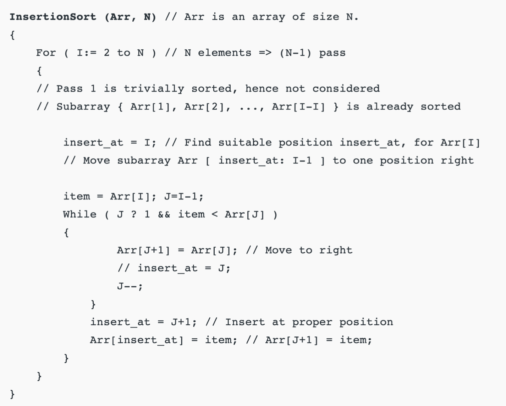
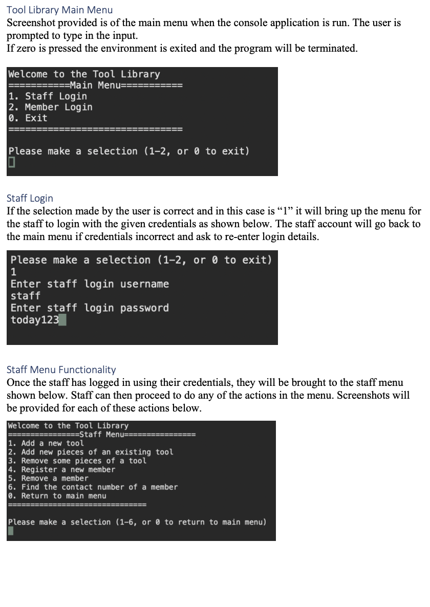

# Software-Application-for-a-Tool-Library

- This repository contains the code for the development of a software application for a tool library. This project was done in the C# programming language in visual studio.

---
### Skills gained at the completion of the project
- This project explore the implementation of data structures such as linked list, binary search tress etc etc.
- Efficiency of algorithms
- Reducing and Optimizing space and time complexity
---
### Installation/Use instructions
-   This project can be opened and run in visual studio.
---
### Completed Project
- Given below is the psuedocode for the insertion sort used and the basic layout for the CLI for the project
- 
- 
---
### Notes about the Project
- open source can use/contribute to it
---
